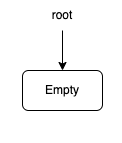
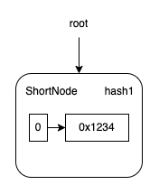
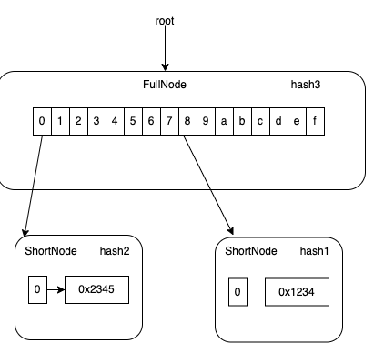
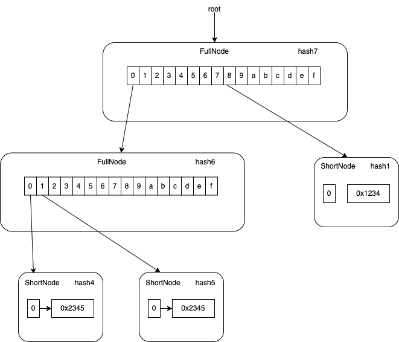

## Ethereum Merkle Patricia Tree

### Node types

- Branch : `fullNode`

- Leaf : `shortNode`

- Empty : `nilValueNode`

### New trie



| key  | val                 |
| ---- | ------------------- |
| root | keccak256(RLP(nil)) |

### First insert



| key   | val             |
| ----- | --------------- |
| root  | hash1           |
| hash1 | RLP([0,0x1234]) |

### Second insert



| key   | val                                                      |
| ----- | -------------------------------------------------------- |
| root  | hash1                                                    |
| hash3 | RLP(hash2,nil,nil,nil,nil,nil,nil,nil,hash1,nil,nil,,,,) |
| hash2 | RLP([0,0x2345])                                          |
| hash1 | RLP([0,0x1234])                                          |

### Third insert



| key   | val                                                        |
| ----- | ---------------------------------------------------------- |
| hash7 | RLP(hash7,nil,nil,nil,nil,nil,nil,nil,hash6,nil,nil,,,,,,) |
| hash6 | RLP(nil,hash4,hash5,nil,,,,,,,,,,,,,)                      |
| hash5 | RLP(4,0x3456)                                              |
| hash4 | RLP(3,0x2345)                                              |
| hash1 | RLP(0,0x1234)                                              |

### Key-value interface

`go-ethereum/trie`

```
func (t *Trie) Get(key []byte) []byte
func (t *Trie) Update(key, value []byte)
func (t *Trie) Delete(key []byte)
```

### Root hash and verifying

The root hash of the trie will be different if any key-value pair was updated.
If two tries have identical key-value pairs, they should have the same merkle root hash.
A trie can provide a proof that certain key-value pair is included in a key-value mapping that produces a merkle root hash.

methods:

```
mt.Prove()
trie.VerifyProof()
```

---

## Underlying DB

Database interface is defined in `go-ethereum/ethdb`
For the examples I've used `memorydb` that implements the interface in memory maps.
For a real node `leveldb` is used.

```
go-ethereum/ethdb
go-ethereum/ethdb/memorydb
go-ethereum/ethdb/leveldb
```

---
